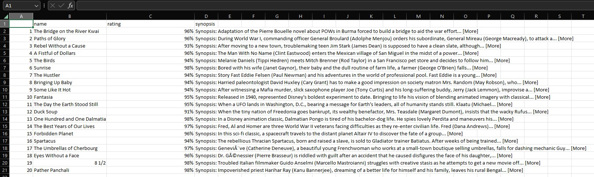

# DataScraping

Simple data scraping from given URL, done with the help of this tutorial:   https://www.youtube.com/watch?v=v8Yh_4oE-Fs
 
</img>
## If you wanna try this:
- Install R on you computer (https://www.r-project.org/)
- Install packages in R’s terminal: install.packages("rvest"); install.packages("dplyr")
- Clone this repo, open it in your code editor
- Run the script
- After you press "run", the script should generate file, called movies.csv, which contains the data
